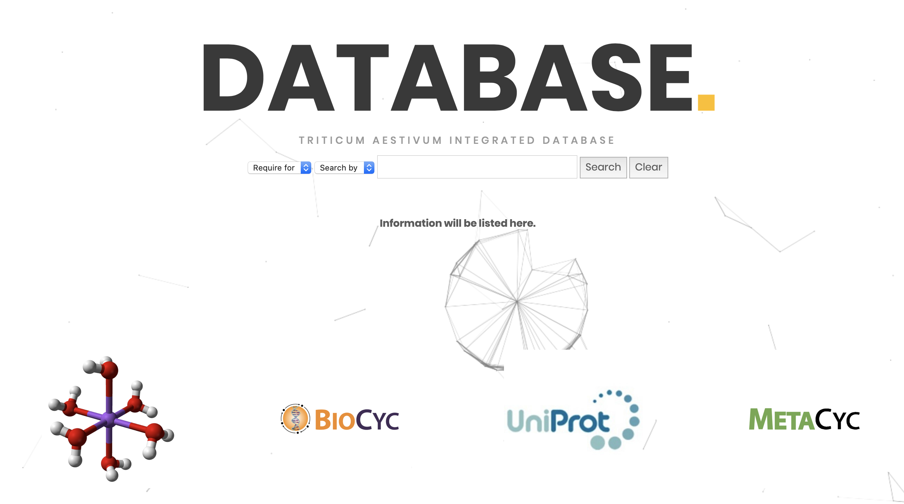
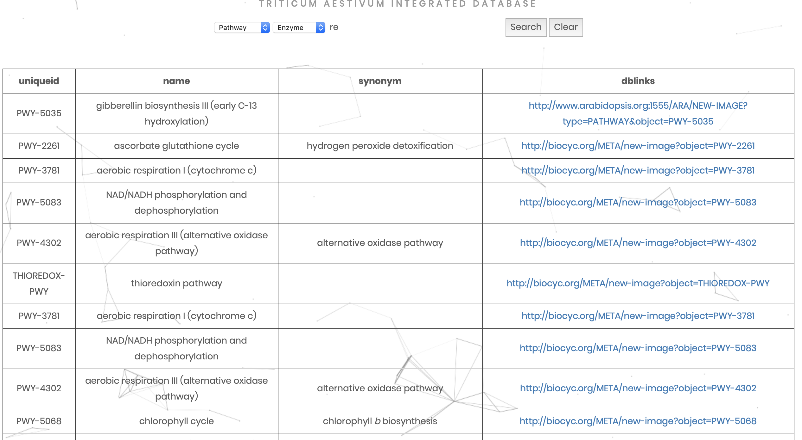

# Database
 A specific database made for wheat. If you wanna try it, click [here](http://reckzhang.top/final/index.html).

### Database UI

### output

- It is an integrated database. Click the last column and you can find the related information in other databases like Uniport and Biocyc.

### Programming language

``SQL`` ``PHP`` ``HTML`` ``CSS`` ``JavaScript`` ``Python``